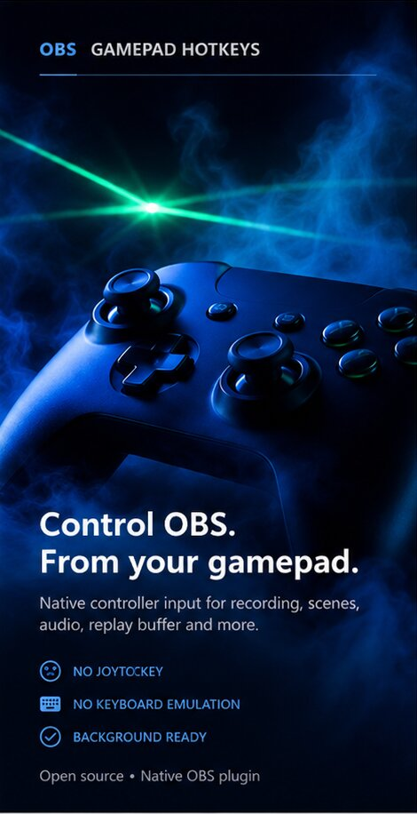

# OBS Gamepad Hotkeys

**Control OBS Studio directly from your gamepad — even while your game or app is in the foreground.**

No JoyToKey. No keyboard emulation. No extra background companion app.

[**🌐 Open the website**](https://masarray.github.io/obs-gamepad-hotkeys/) · [**⬇️ Download the latest Windows installer**](https://github.com/masarray/obs-gamepad-hotkeys/releases/latest) · [**💬 Report a problem**](https://github.com/masarray/obs-gamepad-hotkeys/issues)



> **Current release:** v0.1.7 public preview · Windows 10/11 x64 · Standard + Portable OBS · XInput + DirectInput

## What does it do?

OBS Gamepad Hotkeys lets a controller button trigger an OBS action directly.

For example:

| Gamepad | Default action |
|---|---|
| **B** | Pause / Resume Recording |
| **START** | Start / Stop Recording |

You can also map buttons to scenes, source visibility, mute/unmute, replay buffer actions, other registered OBS hotkeys, and compatible OBS plugins.

The plugin is designed for the common situation where **your game has focus but you still want the controller to operate OBS**.

---

## New in v0.1.7 — reliable OBS Portable support

v0.1.7 fixes the installation path that could make the plugin invisible in **Tools** when using OBS Portable.

- The Smart Installer now **always lets you choose** between Standard OBS and Portable/custom OBS, even when a standard OBS installation is also present on the same PC.
- Portable installs place the DLL in `<OBS root>\obs-plugins\64bit`, never next to `obs64.exe` in `bin\64bit`.
- Portable module data goes to `<OBS root>\data\obs-plugins\obs-gamepad-hotkeys`.
- The manual Portable ZIP is now **direct-extractable into the OBS root folder**.
- CI extracts and validates the Portable ZIP before any release can be published, preventing the old layout from returning.
- Setup launches a selected Portable target using `--portable` after installation.

The runtime gamepad engine is intentionally unchanged in this release; this is a focused reliability and distribution fix.

---

## ArZoom from your gamepad

If [ArZoom for OBS](https://github.com/masarray/arzoom-follow-obs) is installed, Gamepad Hotkeys detects its native OBS action automatically.

Open **Tools → Gamepad Hotkeys → Add Mapping**, press **Listen**, press the controller button you want, then choose:

**ArZoom: Toggle Zoom In / Out**

Press the mapped button once to zoom in and follow the mouse. Press it again to return smoothly to the normal view.

You do **not** need JoyToKey or a keyboard shortcut for this integration. Gamepad Hotkeys routes ArZoom's registered OBS hotkey callback natively.

See the [ArZoom gamepad guide](docs/ARZOOM.md) for the complete beginner setup.

---

## Install and use it in about 2 minutes

### Recommended: Smart Installer

Go to [**Latest Release**](https://github.com/masarray/obs-gamepad-hotkeys/releases/latest) and download:

```text
OBS-Gamepad-Hotkeys-Setup-v0.1.7.exe
```

Close OBS and run Setup. Setup presents the target explicitly:

- **Standard OBS Studio** — system-wide plugin installation.
- **OBS Studio Portable / custom OBS folder** — select the OBS root containing `bin`, `data`, and `obs-plugins`.

The Ready page shows the exact OBS location and plugin target before files are copied.

After installation, open:

**Tools → Gamepad Hotkeys**

Fresh installs already include:

- **B** → Pause / Resume Recording
- **START** → Start / Stop Recording

Try **START** to begin recording, then **B** to pause and resume.

### Manual OBS Portable ZIP

Download:

```text
obs-gamepad-hotkeys-0.1.7-windows-x64-portable.zip
```

Close OBS, then extract the **contents** of the ZIP directly into the OBS Portable root folder — the folder that contains `bin`, `data`, and `obs-plugins`.

After extraction these paths must exist:

```text
<OBS root>\obs-plugins\64bit\obs-gamepad-hotkeys.dll
<OBS root>\data\obs-plugins\obs-gamepad-hotkeys\locale\en-US.ini
```

Do **not** place `obs-gamepad-hotkeys.dll` in `<OBS root>\bin\64bit`; that folder contains the OBS executable and is not the third-party plugin directory.

The ZIP also contains `INSTALL-PORTABLE.txt` with the same recovery instructions.

---

## Add your own gamepad button

1. Open **Tools → Gamepad Hotkeys**.
2. Click **Add Mapping**.
3. Choose **Any Controller** or a specific controller.
4. Click **Listen**.
5. Press the gamepad button you want to use.
6. Search for the OBS action you want.
7. Click **Save**.

That is all. Put your game/app back in the foreground and test the button.

> **Important:** controller input is intentionally **non-exclusive**. The plugin does not steal the button from your game. If the game also uses that button, both the game and OBS can react. Choose a button that fits your control scheme.

---

## Windows Defender / SmartScreen: what should I expect?

Public preview builds may show **“Windows protected your PC”** or **“Unknown Publisher”** when the installer is not yet signed with a trusted public code-signing identity.

That warning is about Windows reputation/signing status; by itself it does **not** mean Windows found malware.

### Safest way to install

1. Download only from this repository's [official GitHub Releases](https://github.com/masarray/obs-gamepad-hotkeys/releases/latest) or from the **Download** button on the official website.
2. Every public release includes a matching `.sha256` file so you can verify the download if you want an extra check.
3. If Windows offers **More info → Run anyway**, proceed only when you downloaded the file from the official release and you trust that source.
4. **Do not disable Microsoft Defender or SmartScreen.** If a managed PC or Smart App Control policy blocks the file completely, follow that policy or ask your IT administrator.

### Optional: verify the installer checksum

Download the `.sha256` file next to the installer, then run PowerShell in your Downloads folder:

```powershell
Get-FileHash .\OBS-Gamepad-Hotkeys-Setup-v0.1.7.exe -Algorithm SHA256
```

Compare the displayed hash with the value in the published `.sha256` file.

The build workflow supports Authenticode signing when a trusted signing certificate is configured.

---

## If something does not work

### “Tools → Gamepad Hotkeys” is missing

If the menu is missing, the plugin module was not loaded. Controller detection is **not** required for the menu to appear.

For OBS Portable verify:

```text
<OBS root>\obs-plugins\64bit\obs-gamepad-hotkeys.dll
<OBS root>\data\obs-plugins\obs-gamepad-hotkeys\locale\en-US.ini
```

Then restart the exact OBS instance you installed into. In OBS, open **Help → Log Files → View Current Log** and search for:

```text
Gamepad Hotkeys
obs-gamepad-hotkeys
```

A successful module load writes:

```text
[Gamepad Hotkeys] plugin loaded
```

If that line is absent, include the nearby module-loading error when opening an issue.

### Listen does not react to my controller

- Confirm the controller works in Windows or in your game.
- Disconnect and reconnect the controller.
- Leave the Gamepad Hotkeys window open for a moment; generic DirectInput devices are rescanned automatically.
- Try **Any Controller** first.

### ArZoom does not appear in the action list

- Confirm ArZoom is installed and visible in OBS.
- Add **ArZoom - Smart Mouse Zoom** to a Display Capture source.
- Restart OBS if ArZoom was just installed.
- Open **Add Mapping** again; the OBS action list refreshes automatically.
- If needed, click the refresh icon in the Gamepad Hotkeys window.

### The game reacts when OBS reacts

That is expected. Input is non-exclusive so the plugin does not take control away from the game. Use a button the game does not need for that moment.

### B does not pause recording

Pause/Resume only applies while a recording is active. Press **START** first to start recording, then press **B**.

### My OBS action is not in the list

Click the **Refresh OBS Actions** icon. The plugin reads the hotkeys currently registered by OBS and compatible OBS plugins.

### Still stuck?

Open a [GitHub Issue](https://github.com/masarray/obs-gamepad-hotkeys/issues) and include:

- OBS version
- Standard or Portable OBS
- controller model
- whether **Tools → Gamepad Hotkeys** appears
- the `Gamepad Hotkeys` / `obs-gamepad-hotkeys` lines from the OBS log
- whether **Listen** detects the button
- the OBS action you tried to map

Those details distinguish installation/loading failures from controller-input failures quickly.

---

## Supported controllers

### XInput

Xbox-compatible controllers are supported through XInput, including:

`A`, `B`, `X`, `Y`, `LB`, `RB`, `BACK`, `START`, `LS`, `RS`, D-pad directions, `LT`, and `RT`.

### DirectInput

Generic USB gamepads and joysticks are supported through DirectInput:

`BUTTON_1` through `BUTTON_128`, plus the first POV/D-pad hat.

The current release is **Windows x64 only**.

---

## Why use this instead of JoyToKey?

A typical setup is:

```text
Gamepad → JoyToKey → keyboard shortcut → OBS
```

OBS Gamepad Hotkeys shortens that to:

```text
Gamepad → OBS Gamepad Hotkeys → OBS action
```

For ArZoom:

```text
Gamepad → OBS Gamepad Hotkeys → ArZoom native OBS action
```

That means:

- no keyboard shortcut injection
- no JoyToKey process that must stay open
- no dependence on which window currently owns keyboard focus
- no companion service or custom controller driver
- the game keeps receiving its normal controller input

---

## Current feature set

- XInput support for Xbox-compatible controllers.
- DirectInput support for generic USB gamepads/joysticks.
- Background + non-exclusive DirectInput access.
- Press **and** release forwarding for hold-style OBS actions such as push-to-talk.
- Automatic device rescan and held-button release on disconnect.
- Native OBS hotkey/action enumeration.
- **First-class ArZoom Toggle Zoom In / Out integration.**
- **Listen** mode for learning a controller button.
- `Any Controller` or device-specific mappings.
- Persistent mapping configuration.
- Smart recording actions for Pause/Resume and Start/Stop.
- Theme-aware Lucide UI icons and high-DPI gamepad button badges.
- Multi-instance-aware Smart Installer for standard and portable OBS installations.
- Direct-extract Portable ZIP with automated release-layout validation.

## Current limitations

- Windows only.
- One-button mappings only; chords, long-press, and double-press are planned.
- DirectInput currently maps buttons + the first POV hat, not arbitrary analog axes.
- XInput/DirectInput duplicate filtering is still heuristic.
- No haptic feedback.
- No per-OBS-profile mapping layer yet.

---

## For developers and contributors

Normal users do **not** need this section.

### One-click local installer test

After cloning the repository, double-click:

```text
BUILD-INSTALLER-AND-RUN.cmd
```

It performs:

```text
bootstrap → CMake configure → plugin build → installer build → launch installer
```

To build without launching Setup:

```text
BUILD-INSTALLER.cmd
```

### Manual build

Requirements:

- Windows 10/11 x64
- Visual Studio 2022 with Desktop development with C++
- Windows SDK
- CMake 3.28+
- Internet access for the initial OBS/Qt dependency bootstrap

```powershell
.\scripts\bootstrap-template.ps1
cmake --preset windows-x64
cmake --build --preset windows-x64
```

Developer direct-install for standard OBS:

```powershell
.\scripts\install-local.ps1
```

For OBS Portable:

```powershell
.\scripts\install-local.ps1 -PortableRoot "D:\OBS-Studio"
```

Create the direct-extract Portable ZIP:

```powershell
.\scripts\package.ps1
```

### Engineering notes

The plugin intentionally does not use `SendInput` or virtual keyboard shortcuts. Controller polling runs on a worker thread, OBS execution is marshalled to `OBS_TASK_UI`, and the final action is routed through OBS's registered hotkey callback.

The project currently builds against OBS 31.1.1 as its compatibility baseline rather than chasing the newest host for a packaging-only fix. OBS 32.2.2 is the current upstream release as of August 2026; runtime compatibility should still be verified through the release test matrix on representative supported OBS versions.

See:

- [ArZoom integration](docs/ARZOOM.md)
- [Architecture](docs/ARCHITECTURE.md)
- [Installer](docs/INSTALLER.md)
- [Test plan](docs/TEST_PLAN.md)
- [Roadmap](docs/ROADMAP.md)

---

## License and project status

Open source under **GPL-2.0-or-later**. Lucide icons are used under the ISC License.

OBS is a trademark of the OBS Project. This independent project is not affiliated with or endorsed by the OBS Project.
